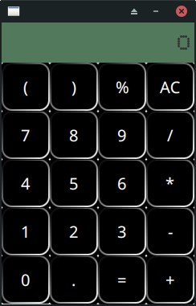

# Calculadora JavaFX

### O projeto basicamente é a criação de uma calculadora básica. 

## Desafios:
- [x] Estilização da Calculadora

- [ ] Animações das teclas

- [ ] Som clássico de calculadora

- [ ] Interações dos botões com o label.

- [ ] Normalização das interações dos botões com as regras matemática.

## Objetivo
- #### O principal objetivo foi tirar do papel os conhecimentos em java sem ter que ficar fazendo estrutura web e criar um portifólio.

## Tecnologias utilizadas

- #### Java, JavaFX e CSS(Esse css é próprio para o JavaFX)